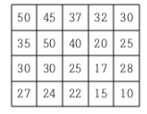
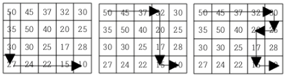

# 1520 : 내리막 길
- 문제 링크: [1520](https://www.acmicpc.net/problem/1520)

## 문제
### 내용
여행을 떠난 세준이는 지도를 하나 구하였다. 이 지도는 아래 그림과 같이 직사각형 모양이며 여러 칸으로 나뉘어져 있다. 한 칸은 한 지점을 나타내는데 각 칸에는 그 지점의 높이가 쓰여 있으며, 각 지점 사이의 이동은 지도에서 상하좌우 이웃한 곳끼리만 가능하다.



현재 제일 왼쪽 위 칸이 나타내는 지점에 있는 세준이는 제일 오른쪽 아래 칸이 나타내는 지점으로 가려고 한다. 그런데 가능한 힘을 적게 들이고 싶어 항상 높이가 더 낮은 지점으로만 이동하여 목표 지점까지 가고자 한다. 위와 같은 지도에서는 다음과 같은 세 가지 경로가 가능하다.



지도가 주어질 때 이와 같이 제일 왼쪽 위 지점에서 출발하여 제일 오른쪽 아래 지점까지 항상 내리막길로만 이동하는 경로의 개수를 구하는 프로그램을 작성하시오.

### 입력
첫째 줄에는 지도의 세로의 크기 M과 가로의 크기 N이 빈칸을 사이에 두고 주어진다. 이어 다음 M개 줄에 걸쳐 한 줄에 N개씩 위에서부터 차례로 각 지점의 높이가 빈 칸을 사이에 두고 주어진다. M과 N은 각각 500이하의 자연수이고, 각 지점의 높이는 10000이하의 자연수이다.

### 출력
첫째 줄에 이동 가능한 경로의 수 H를 출력한다. 모든 입력에 대하여 H는 10억 이하의 음이 아닌 정수이다.

## 풀이
### 풀이 코드
```cpp
/* [풀이]
1. DFS : 현재 위치로 오기 위해 몇 가지의 가능성이 있는지 계산하는 함수
주변 칸 탐색 후 자신의 값보다 크다면, 해당 칸에서 추가 탐색(재귀)
2. 중복된 탐색을 할 수 있으므로, 탐색을 한 후 dp(Dynamic Programming)에 저장.
dp에 값이 있다면 해당 값을 반환하고, 아니라면 계산 실행
*/

#include <bits/stdc++.h>
using namespace std;

// 입력값
int M, N;
vector<vector<int>> grid, dp;

int answer = 0; // 현재까지 도달 횟수

// DFS용
int dy[4] = { 1, -1, 0, 0 };
int dx[4] = { 0, 0, 1, -1 };

// 현재 칸(cy, cx)까지의 경로 계산
int DFS(int cy, int cx) {
	if(dp[cy][cx] != -1) return dp[cy][cx]; // 이미 방문했다면 계산한 값 반환

	int cnt = 0; // 현재 칸으로 오는 경로 갯수
	for(int i = 0; i < 4; i++) { // 주변 탐색
		int ny = cy + dy[i];
		int nx = cx + dx[i];
		if(ny < 0 || ny >= M || nx < 0 || nx >= N) continue; // 범위를 벗어나면 pass
		if(grid[cy][cx] < grid[ny][nx]) cnt += DFS(ny, nx); // 더 작은 쪽에서 경로를 받을 수 있음
	}
	dp[cy][cx] = cnt; // dp값 업데이트
	return dp[cy][cx]; // 해당 값 출력
}

int main()
{
	ios::sync_with_stdio(0), cin.tie(0);
	cin >> M >> N; // 입력
	grid.assign(M, vector<int>(N)); // 동적 할당 M x N
	for(auto& vi : grid) {	// vi : Vector<Int>
		for(int& i : vi) { // i : Int
			cin >> i; // 입력
		}
	}

	dp.assign(M, vector<int>(N, -1)); // 동적 할당 M x N. 0으로 초기화
	dp[0][0] = 1;  // 시작지점까지의 경로는 1개

	cout << DFS(M - 1, N - 1); // 도착지점까지의 경로 출력
}
```