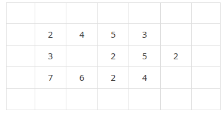
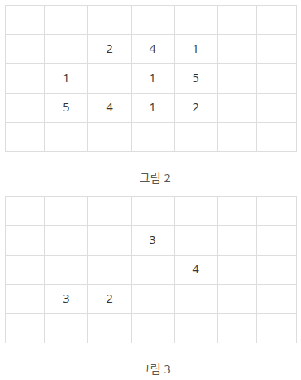

# 2573 : 빙산
- 문제 링크: [2573](https://www.acmicpc.net/problem/2573)

## 문제
### 내용
지구 온난화로 인하여 북극의 빙산이 녹고 있다. 빙산을 그림 1과 같이 2차원 배열에 표시한다고 하자. 빙산의 각 부분별 높이 정보는 배열의 각 칸에 양의 정수로 저장된다. 빙산 이외의 바다에 해당되는 칸에는 0이 저장된다. 그림 1에서 빈칸은 모두 0으로 채워져 있다고 생각한다.



빙산의 높이는 바닷물에 많이 접해있는 부분에서 더 빨리 줄어들기 때문에, 배열에서 빙산의 각 부분에 해당되는 칸에 있는 높이는 일년마다 그 칸에 동서남북 네 방향으로 붙어있는 0이 저장된 칸의 개수만큼 줄어든다. 단, 각 칸에 저장된 높이는 0보다 더 줄어들지 않는다. 바닷물은 호수처럼 빙산에 둘러싸여 있을 수도 있다. 따라서 그림 1의 빙산은 일년후에 그림 2와 같이 변형된다.

그림 3은 그림 1의 빙산이 2년 후에 변한 모습을 보여준다. 2차원 배열에서 동서남북 방향으로 붙어있는 칸들은 서로 연결되어 있다고 말한다. 따라서 그림 2의 빙산은 한 덩어리이지만, 그림 3의 빙산은 세 덩어리로 분리되어 있다.



한 덩어리의 빙산이 주어질 때, 이 빙산이 두 덩어리 이상으로 분리되는 최초의 시간(년)을 구하는 프로그램을 작성하시오. 그림 1의 빙산에 대해서는 2가 답이다. 만일 전부 다 녹을 때까지 두 덩어리 이상으로 분리되지 않으면 프로그램은 0을 출력한다.

### 입력
첫 줄에는 이차원 배열의 행의 개수와 열의 개수를 나타내는 두 정수 N과 M이 한 개의 빈칸을 사이에 두고 주어진다. N과 M은 3 이상 300 이하이다. 그 다음 N개의 줄에는 각 줄마다 배열의 각 행을 나타내는 M개의 정수가 한 개의 빈 칸을 사이에 두고 주어진다. 각 칸에 들어가는 값은 0 이상 10 이하이다. 배열에서 빙산이 차지하는 칸의 개수, 즉, 1 이상의 정수가 들어가는 칸의 개수는 10,000 개 이하이다. 배열의 첫 번째 행과 열, 마지막 행과 열에는 항상 0으로 채워진다.

### 출력
첫 줄에 빙산이 분리되는 최초의 시간(년)을 출력한다. 만일 빙산이 다 녹을 때까지 분리되지 않으면 0을 출력한다.

## 풀이
### 풀이 코드
```cpp
/* [풀이]
1. 총 3가지 단계
(1) 빙하가 몇 개의 그룹인지 확인한다
(2) 빙하가 얼마나 녹을지 확인한다
(3) 빙하를 녹인다
2. 1-(1)을 할 때 dfs 사용. 
이미 한 번 dfs를 했는데, 한 번 더 해야하면 그룹이 2개 이상
한 번도 dfs를 안했는데 함수가 종료되면 모두 0인 상태
3. 결과물 출력
*/

#include <bits/stdc++.h>
#define Y first
#define X second
using namespace std;

int N, M, year = 0;
vector<vector<int>> grid, after; // grid : 원래 빙하 / after : 경과

int dy[4] = { 1, -1, 0, 0 };
int dx[4] = { 0, 0, 1, -1 };

bool IsOneGroup() {
	vector<vector<bool>> isVisited(N, vector<bool>(M, false));
	bool isFirst = true;
	for(int y = 0; y < N; y++) {
		for(int x = 0; x < M; x++) {
			if(grid[y][x] == 0) continue; // 녹을 빙하가 없다면 continue
			if(isVisited[y][x]) continue; // 이미 방문한 칸이라면 continue
			// 이미 dfs를 돌렸다면 다른 그룹이 있는 것이니 false 반환
			if(!isFirst) return false;	
			isFirst = false; // dfs를 돌릴 것이기에 false 설정

			stack<pair<int, int>> stk; // dfs용 stk
			stk.push({y, x});
			while(!stk.empty()) {
				int cy = stk.top().Y;
				int cx = stk.top().X;
				stk.pop();
				if(isVisited[cy][cx]) continue;
				isVisited[cy][cx] = true;
				for(int i = 0; i < 4; i++) {
					int ny = cy + dy[i];
					int nx = cx + dx[i];
					if(ny < 0 || ny >= N || nx < 0 || nx >= M) continue;
					if(grid[ny][nx] == 0) continue;
					if(isVisited[ny][nx]) continue;
					stk.push({ny, nx});
				}
			}
		}
	}

	if(isFirst) { // 모두 0이라면
		year = 0; // year는 0
		return false; // while문 탈출
	}
	return true;
}

void AfterOneYear() {
	year++; // 1년 추가
	// 얼마나 녹는지 구하기
	for(int cy = 0; cy < N; cy++) {
		for(int cx = 0; cx < M; cx++) {
			if(grid[cy][cx] == 0) continue; // 녹을 빙하가 없다면 continue
			after[cy][cx] = 0;
			for(int i = 0; i < 4; i++) {
				int ny = cy + dy[i];
				int nx = cx + dx[i];
				if(ny < 0 || ny >= N || nx < 0 || nx >= M) continue;
				if(grid[ny][nx] == 0) after[cy][cx]--; // 주변에 바다가 있다면 녹음
			}
		}
	}

	// 녹은 값 업데이트
	for(int cy = 0; cy < N; cy++) {
		for(int cx = 0; cx < M; cx++) {
			if(grid[cy][cx] == 0) continue; // 녹을 빙하가 없다면 continue
			grid[cy][cx] += after[cy][cx];
			if(grid[cy][cx] < 0) grid[cy][cx] = 0; // 0보다 더 녹았으면 0으로 설정
		}
	}
}

int main()
{
	ios::sync_with_stdio(0), cin.tie(0);
	cin >> N >> M;
	grid.assign(N, vector<int>(M));
	after.assign(N, vector<int>(M));

	for(auto& vi : grid) {
		for(int& i : vi) {
			cin >> i;
		}
	}
	while(IsOneGroup()) AfterOneYear();
	cout << year;
}
```