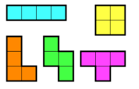

# 14500 : 테트로미노
- 문제 링크: [14500](https://www.acmicpc.net/problem/14500)

## 문제
### 내용
폴리오미노란 크기가 1×1인 정사각형을 여러 개 이어서 붙인 도형이며, 다음과 같은 조건을 만족해야 한다.

정사각형은 서로 겹치면 안 된다.
도형은 모두 연결되어 있어야 한다.
정사각형의 변끼리 연결되어 있어야 한다. 즉, 꼭짓점과 꼭짓점만 맞닿아 있으면 안 된다.
정사각형 4개를 이어 붙인 폴리오미노는 테트로미노라고 하며, 다음과 같은 5가지가 있다.



아름이는 크기가 N×M인 종이 위에 테트로미노 하나를 놓으려고 한다. 종이는 1×1 크기의 칸으로 나누어져 있으며, 각각의 칸에는 정수가 하나 쓰여 있다.

테트로미노 하나를 적절히 놓아서 테트로미노가 놓인 칸에 쓰여 있는 수들의 합을 최대로 하는 프로그램을 작성하시오.

테트로미노는 반드시 한 정사각형이 정확히 하나의 칸을 포함하도록 놓아야 하며, 회전이나 대칭을 시켜도 된다.

### 입력
첫째 줄에 종이의 세로 크기 N과 가로 크기 M이 주어진다. (4 ≤ N, M ≤ 500)

둘째 줄부터 N개의 줄에 종이에 쓰여 있는 수가 주어진다. i번째 줄의 j번째 수는 위에서부터 i번째 칸, 왼쪽에서부터 j번째 칸에 쓰여 있는 수이다. 입력으로 주어지는 수는 1,000을 넘지 않는 자연수이다.

### 출력
첫째 줄에 테트로미노가 놓인 칸에 쓰인 수들의 합의 최댓값을 출력한다.

## 풀이
### 풀이 코드
```cpp
/* [풀이]
1. 모든 경우의 수를 다 찾아야한다.
2. 한 칸씩 확장해서 4칸이 될 때의 합을 확인(ㅡ, ㅣ, ㄴ, ㄱ, ㅁ)
3. 그 외 모양 확인(ㅏ, ㅗ, ㅓ, ㅜ)
4. 모든 칸 확인 후 그 중 가장 큰 값 확인
*/

#include <bits/stdc++.h>
#define Y first
#define X second
using namespace std;
int N, M, mx = 0;
vector<vector<int>> space;
vector<pair<int, int>> tetris;

void FindMax(int y, int x, int idx) { // 현재 위치(y, x). 몇 번째 칸인지 확인(0~3)
	if (y < 0 || y >= N || x < 0 || x >= M) return; // 범위 밖
	for (auto pii : tetris) if (pii.Y == y && pii.X == x) return; // 이미 탐색한 칸이면 탈출

	tetris.push_back({ y, x }); // 현재 칸 추가
	if (idx == 3) { // 4칸째
		int sum = 0; // 전체 합 계산
		for (auto vii : tetris) sum += space[vii.Y][vii.X]; 
		if (sum > mx) mx = sum; // 최대치보다 크면 최대치 없데이트
	}
	else {
		FindMax(y + 1, x, idx + 1); // 상
		FindMax(y - 1, x, idx + 1); // 하
		FindMax(y, x + 1, idx + 1); // 좌
		FindMax(y, x - 1, idx + 1); // 우
	}
	tetris.pop_back(); // 현재 칸 제거
}

void FindTValue(int y, int x) {
	if ((y == 0 || y == N - 1) && (x == 0 || x == M - 1)) return;
	int sum = 0;
	if (y == 0) sum = space[y][x] + space[y][x - 1] + space[y][x + 1] + space[y + 1][x]; // ㅜ
	else if (x == 0) sum = space[y][x] + space[y - 1][x] + space[y + 1][x] + space[y][1];  // ㅏ
	else if (y == N - 1) sum = space[y][x] + space[y][x - 1] + space[y][x + 1] + space[y - 1][x]; // ㅓ
	else if (x == M - 1) sum = space[y][x] + space[y][x - 1] + space[y + 1][x] + space[y - 1][x]; // ㅗ
	else {
		sum = space[y][x] + space[y][x - 1] + space[y][x + 1] + space[y + 1][x] + space[y - 1][x]; // +
		int mn = min(min(space[y + 1][x], space[y - 1][x]), min(space[y][x + 1], space[y][x - 1])); // 상하좌우 중 가장 작은 것
		sum -= mn; // 빼기
	}
	if (mx < sum) mx = sum;
}
int main()
{
	ios::sync_with_stdio(0), cin.tie(0);
	cin >> N >> M;
	space.assign(N, vector<int>(M));
	for (auto& vi : space) for (int& i : vi) cin >> i;

	for (int i = 0; i < N; i++) {
		for (int j = 0; j < M; j++) {
			FindMax(i, j, 0); // ㅡ, ㅣ, ㄴ, ㄱ, ㅁ 등
			FindTValue(i, j); // ㅓ, ㅗ, ㅜ, ㅏ
		}
	}
	cout << mx;
}
```