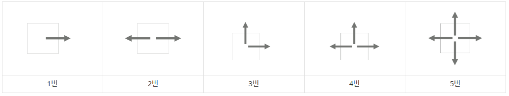
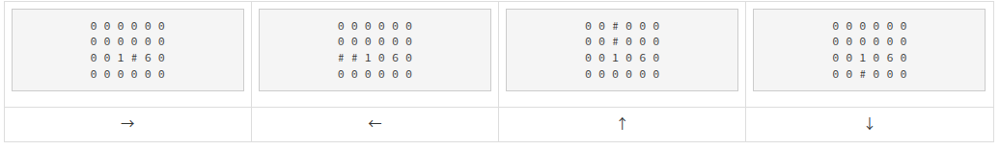
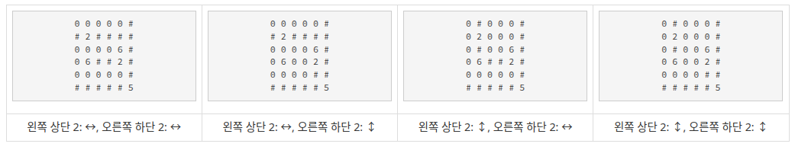

# 15683 : 감시
- 문제 링크: [15683](https://www.acmicpc.net/problem/15683)

## 문제
### 내용
스타트링크의 사무실은 1×1크기의 정사각형으로 나누어져 있는 N×M 크기의 직사각형으로 나타낼 수 있다. 사무실에는 총 K개의 CCTV가 설치되어져 있는데, CCTV는 5가지 종류가 있다. 각 CCTV가 감시할 수 있는 방법은 다음과 같다.



1번 CCTV는 한 쪽 방향만 감시할 수 있다. 2번과 3번은 두 방향을 감시할 수 있는데, 2번은 감시하는 방향이 서로 반대방향이어야 하고, 3번은 직각 방향이어야 한다. 4번은 세 방향, 5번은 네 방향을 감시할 수 있다.

CCTV는 감시할 수 있는 방향에 있는 칸 전체를 감시할 수 있다. 사무실에는 벽이 있는데, CCTV는 벽을 통과할 수 없다. CCTV가 감시할 수 없는 영역은 사각지대라고 한다.

CCTV는 회전시킬 수 있는데, 회전은 항상 90도 방향으로 해야 하며, 감시하려고 하는 방향이 가로 또는 세로 방향이어야 한다.

```
0 0 0 0 0 0
0 0 0 0 0 0
0 0 1 0 6 0
0 0 0 0 0 0
```


CCTV는 벽을 통과할 수 없기 때문에, 1번이 → 방향을 감시하고 있을 때는 6의 오른쪽에 있는 칸을 감시할 수 없다.

```
0 0 0 0 0 0
0 2 0 0 0 0
0 0 0 0 6 0
0 6 0 0 2 0
0 0 0 0 0 0
0 0 0 0 0 5
```


CCTV는 CCTV를 통과할 수 있다. 아래 예시를 보자.

```
0 0 2 0 3
0 6 0 0 0
0 0 6 6 0
0 0 0 0 0
```

위와 같은 경우에 2의 방향이 ↕ 3의 방향이 ←와 ↓인 경우 감시받는 영역은 다음과 같다.

```
# # 2 # 3
0 6 # 0 #
0 0 6 6 #
0 0 0 0 #
```

사무실의 크기와 상태, 그리고 CCTV의 정보가 주어졌을 때, CCTV의 방향을 적절히 정해서, 사각 지대의 최소 크기를 구하는 프로그램을 작성하시오.

### 입력
첫째 줄에 사무실의 세로 크기 N과 가로 크기 M이 주어진다. (1 ≤ N, M ≤ 8)

둘째 줄부터 N개의 줄에는 사무실 각 칸의 정보가 주어진다. 0은 빈 칸, 6은 벽, 1~5는 CCTV를 나타내고, 문제에서 설명한 CCTV의 종류이다. 

CCTV의 최대 개수는 8개를 넘지 않는다.

### 출력
첫째 줄에 사각 지대의 최소 크기를 출력한다.

## 풀이
### 풀이 코드
```cpp
/* [풀이]
1. 백트래킹으로 모두 탐색한다.
2. 카메라의 위치를 vector에 저장하고, 카메라별 모든 가능성을 탐색한다.
3. 방문/방문 취소 함수를 만들고. 방문했을 때 +1, 방문 취소했을 때 -1을 한다.
(벽은 +1을 하고 시작한다.)
4. 한 줄을 탐색할 때 범위를 벗어나거나 벽을 만나면 방문/방문 취소를 종료한다.
5. 현재 최솟값보다 현재의 값이 적으면 값을 업데이트한다.
*/

#include <bits/stdc++.h>
#define Y first
#define X second
using namespace std;

int dy[4] = { 0, -1, 0, 1 }; // 우, 하, 좌, 상
int dx[4] = { 1, 0, -1, 0 }; // 우, 하, 좌, 상

int N, M; // 입력값
vector<vector<int>> grid;
vector<vector<int>> isVisited;
vector<pair<int, int>> cctv;

int minimum; // 최솟값 => 정답

void FillLine(int idx, int dir, bool isActive) { // 줄 채우는 함수
    int cy = cctv[idx].Y;
    int cx = cctv[idx].X;
    
    while(1) {
        cy += dy[dir];
        cx += dx[dir];
        if(cy < 0 || cy >= N || cx < 0 || cx >= M) break; // 범위 밖
        if(grid[cy][cx] == 6) break; // 벽
        isVisited[cy][cx] += (isActive ? 1 : -1); // +1 or -1
    }
}

void CheckCCTV(int idx) {
    if(idx == cctv.size()) { // 모든 cctv 확인
        int cnt = 0;
        for(int i = 0; i < N; i++) { // 갯수 체크
            for(int j = 0; j < M; j++) {
                if(!isVisited[i][j]) cnt++;
            }
        }
        if(cnt < minimum) minimum = cnt; // 값 업데이트
        return;
    }

    switch(grid[cctv[idx].Y][cctv[idx].X]) {
    case 1: // 1번 카메라
        for(int i = 0; i < 4; i++) {
            FillLine(idx, i, true); // 1방향 방문
            CheckCCTV(idx + 1);
            FillLine(idx, i, false); // 1 방향 방문 취소
        }
        break;
    case 2: // 2번 카메라
        for(int i = 0; i < 4; i++) {
            FillLine(idx, i, true); // 2방향 방문
            FillLine(idx, (i + 2) % 4, true); // 반대 방향
            CheckCCTV(idx + 1);
            FillLine(idx, i, false); // 방문 취소
            FillLine(idx, (i + 2) % 4, false);
        }
        break;
    case 3: // 3번 카메라
        for(int i = 0; i < 4; i++) {
            FillLine(idx, i, true); // 2방향 방문
            FillLine(idx, (i + 1) % 4, true); // 옆방향
            CheckCCTV(idx + 1);
            FillLine(idx, i, false);
            FillLine(idx, (i + 1) % 4, false);
        }
        break;
    case 4:
        for(int i = 0; i < 4; i++) {
            FillLine(idx, i, true); // 세 방향
            FillLine(idx, (i + 1) % 4, true);
            FillLine(idx, (i + 2) % 4, true);
            CheckCCTV(idx + 1);
            FillLine(idx, i, false);
            FillLine(idx, (i + 1) % 4, false);
            FillLine(idx, (i + 2) % 4, false);
        }
        break;
    case 5: 
        for(int i = 0; i < 4; i++) { // 모든 방향
            FillLine(idx, i, true);
        }        
        CheckCCTV(idx + 1);
        for(int i = 0; i < 4; i++) {
            FillLine(idx, i, false);
        }        
        break;
    }

}

int main()
{
    ios::sync_with_stdio(0), cin.tie(0);
    cin >> N >> M;
    minimum = N * M; // 최소치의 Max = N * M

    grid.assign(N, vector<int>(M));
    isVisited.assign(N, vector<int>(M, 0));
    for(int i = 0; i < N; i++) {
        for(int j = 0; j < M; j++) {
            cin >> grid[i][j];
            if(grid[i][j] >= 1 && grid[i][j] <= 5) cctv.push_back({i, j});
            if(grid[i][j] >= 1) isVisited[i][j]++;
        }
    }
    CheckCCTV(0);
    cout << minimum;
}
```