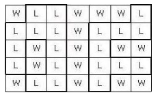

# 2589 : 보물섬
- 문제 링크: [2589](https://www.acmicpc.net/problem/2589)

## 문제
### 내용
보물섬 지도를 발견한 후크 선장은 보물을 찾아나섰다. 보물섬 지도는 아래 그림과 같이 직사각형 모양이며 여러 칸으로 나뉘어져 있다. 각 칸은 육지(L)나 바다(W)로 표시되어 있다. 이 지도에서 이동은 상하좌우로 이웃한 육지로만 가능하며, 한 칸 이동하는데 한 시간이 걸린다. 보물은 서로 간에 최단 거리로 이동하는데 있어 가장 긴 시간이 걸리는 육지 두 곳에 나뉘어 묻혀있다. 육지를 나타내는 두 곳 사이를 최단 거리로 이동하려면 같은 곳을 두 번 이상 지나가거나, 멀리 돌아가서는 안 된다.



예를 들어 위와 같이 지도가 주어졌다면 보물은 아래 표시된 두 곳에 묻혀 있게 되고, 이 둘 사이의 최단 거리로 이동하는 시간은 8시간이 된다.


보물 지도가 주어질 때, 보물이 묻혀 있는 두 곳 간의 최단 거리로 이동하는 시간을 구하는 프로그램을 작성하시오.

### 입력
첫째 줄에는 보물 지도의 세로의 크기와 가로의 크기가 빈칸을 사이에 두고 주어진다. 이어 L과 W로 표시된 보물 지도가 아래의 예와 같이 주어지며, 각 문자 사이에는 빈 칸이 없다. 보물 지도의 가로, 세로의 크기는 각각 50이하이다.

### 출력
첫째 줄에 보물이 묻혀 있는 두 곳 사이를 최단 거리로 이동하는 시간을 출력한다.

## 풀이
### 풀이 코드
```cpp
/* [풀이]
1. 모든 땅마다 해당 위치에 보물이 있다고 가정하고
가장 먼 곳에 다른 보물을 배치한다.
2. 해당 값이 현재의 정답보다 크다면 정답을 업데이트한다.
3. 모든 칸을 돌았을 때, 최종 정답이 된다.
*/
#include <bits/stdc++.h>
using namespace std;

int dx[4] = { 1, -1, 0, 0 };
int dy[4] = { 0, 0, 1, -1 };

int R, C, answer = 0;
vector<string> space;

// 현재 칸에 보물을 묻었다고 가정하고,
// 다른 어떤 곳에 보물을 묻을 수 있는지 확인한다.
void FindOtherTreasure(int y, int x) {
	vector<vector<int>> rank(R, vector<int>(C, -1));
	rank[y][x] = 0;
	queue<tuple<int, int, int>> q; // BFS, {y, x, rank}
	q.push({ y, x, 0 });

	while (!q.empty()) { // BFS 실행
		int cy, cx, cr; // CurrentY, CurrentX, CurrentRank
		tie(cy, cx, cr) = q.front();
		q.pop();

		for (int i = 0; i < 4; i++) {
			int ny = cy + dy[i];
			int nx = cx + dx[i];
			if (ny < 0 || ny >= R || nx < 0 || nx >= C) continue;
			if (space[ny][nx] == 'W') continue;
			if (rank[ny][nx] != -1) continue;
			rank[ny][nx] = cr + 1;
			answer = max(answer, cr + 1); // 최대 칸이 현재 답보다 큰지 확인
			q.push({ ny, nx, cr + 1 });
		}
	}
}

int main()
{
	ios::sync_with_stdio(0), cin.tie(0);
	cin >> R >> C;
	space.resize(R);
	for (auto& s : space) cin >> s;
	for (int i = 0; i < R; i++) {
		for (int j = 0; j < C; j++) {
			if (space[i][j] == 'L') { // 땅이라면 확인
				FindOtherTreasure(i, j);
			}
		}
	}
	cout << answer;
}
```