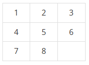
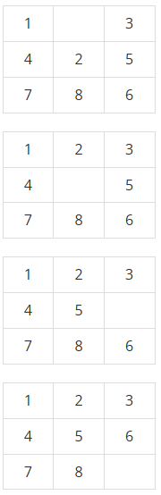

# 1525 : 퍼즐
- 문제 링크: [1525](https://www.acmicpc.net/problem/1525)

## 문제
### 내용
3×3 표에 다음과 같이 수가 채워져 있다. 오른쪽 아래 가장 끝 칸은 비어 있는 칸이다.



어떤 수와 인접해 있는 네 개의 칸 중에 하나가 비어 있으면, 수를 그 칸으로 이동시킬 수가 있다. 물론 표 바깥으로 나가는 경우는 불가능하다. 우리의 목표는 초기 상태가 주어졌을 때, 최소의 이동으로 위와 같은 정리된 상태를 만드는 것이다. 다음의 예를 보자.



가장 윗 상태에서 세 번의 이동을 통해 정리된 상태를 만들 수 있다. 이와 같이 최소 이동 횟수를 구하는 프로그램을 작성하시오.

### 입력
세 줄에 걸쳐서 표에 채워져 있는 아홉 개의 수가 주어진다. 한 줄에 세 개의 수가 주어지며, 빈 칸은 0으로 나타낸다.

### 출력
첫째 줄에 최소의 이동 횟수를 출력한다. 이동이 불가능한 경우 -1을 출력한다.

## 풀이
### 풀이 코드
```cpp
/* [풀이]
1. 경로를 string으로 바꿔서 저장 후 unordered_set으로 중복 제거
2. BFS로 하나씩 탐색. 최종 목표에 도달하면 종료
*/

#include <bits/stdc++.h>
#define STR first
#define CNT second
using namespace std;

int dy[] = { 1, -1, 0, 0 };
int dx[] = { 0, 0, 1, -1 };

string goal = "123456780";

int BFS(string start) {
    queue<pair<string, int>> q;
    unordered_set<string> visited;

    q.push({start, 0});
    visited.insert(start);

    while (!q.empty()) {
        string curGrid = q.front().STR;
        int cnt = q.front().CNT;
        q.pop();

        if (curGrid == goal) return cnt;

        int curZero = curGrid.find('0');
        int cy = curZero / 3;
        int cx = curZero % 3;

        for (int i = 0; i < 4; i++) {
            int ny = cy + dx[i];
            int nx = cx + dy[i];
            if(nx < 0 || nx >= 3 || ny < 0 || ny >= 3) continue;
            int nextZero = ny * 3 + nx;
            string nextGrid = curGrid;
            swap(nextGrid[curZero], nextGrid[nextZero]);
            if (visited.find(nextGrid) == visited.end()) {
                visited.insert(nextGrid);
                q.push({nextGrid, cnt + 1});
            }
        }
    }
    return -1;
}

int main() {
    ios::sync_with_stdio(0), cin.tie(0);
    string start = "";
    for(int i = 0; i < 9; i++) {
        int num;
        cin >> num;
        start += to_string(num);
    }
    cout << BFS(start) << '\n';
}
```
### STL(unordered_set)
`unordered_set`은 자료를 중복/정렬 없이 저장하는 자료구조로,<br>
정렬이 없기에 `set`보다 빠른 특징이 있습니다.<br>

알고리즘 풀이에서는 보통 `set`보다 많이 사용됩니다.<br>

---

`unordered_set`은 C++ STL(Standard Template Library)에서 제공하는 연관 컨테이너 중 하나로, **고유한(중복 없는) 원소들을 저장**하면서, 원소들 간의 **특정 순서를 보장하지 않는** 자료구조입니다. 내부 구현은 보통 **해시 테이블**을 기반으로 합니다.

### 주요 특징

1. **해시 테이블 기반**  
   - `unordered_set`은 해시 함수를 사용하여 원소들을 해시 값에 매핑합니다.  
   - 이 덕분에 평균적으로 **삽입, 삭제, 검색** 연산을 \(O(1)\) 시간에 처리할 수 있습니다.  
   - 최악의 경우(해시 충돌이 많이 발생하는 경우)에는 \(O(n)\)까지 성능이 저하될 수 있습니다.

2. **원소의 중복이 허용되지 않음**  
   - `unordered_set`은 동일한 값을 두 번 저장하지 않습니다.  
   - 이를 통해 집합(set) 자료구조의 특성을 유지합니다.

3. **순서 보장이 없음**  
   - 내부적으로 해시 테이블을 사용하기 때문에, 원소들이 삽입된 순서나 정렬된 순서를 보장하지 않습니다.  
   - 원소들을 순회할 때 순서가 임의의 순서로 나타납니다.

4. **인터페이스**  
   - `insert(value)`: 원소를 삽입합니다.
   - `erase(value)`: 원소를 제거합니다.
   - `find(value)`: 원소를 검색하여, 존재하면 해당 반복자(iterator)를 반환하고, 없으면 `end()`를 반환합니다.
   - `count(value)`: 원소의 개수를 반환합니다. `unordered_set`에서는 원소가 있으면 항상 1, 없으면 0을 반환합니다.
   - `begin()`, `end()`: 원소들을 순회하기 위한 반복자를 제공합니다.

5. **커스터마이징**  
   - 해시 함수와 비교 함수를 사용자가 지정할 수 있어, 기본 타입 외에도 사용자 정의 타입의 원소를 저장할 수 있습니다.
   - 예를 들어, 사용자 정의 타입에 대해 `std::hash`를 재정의하거나, 커스텀 해시 함수를 제공할 수 있습니다.

### 사용 예시

```cpp
#include <iostream>
#include <unordered_set>
using namespace std;

int main() {
    // 정수형 unordered_set 선언
    unordered_set<int> uset;

    // 원소 삽입
    uset.insert(42);
    uset.insert(17);
    uset.insert(23);
    uset.insert(42); // 중복 삽입은 무시됨

    // 원소 검색
    if(uset.find(17) != uset.end()){
        cout << "17 is in the unordered_set.\n";
    }

    // 원소 개수 세기 (존재하면 1, 없으면 0)
    cout << "Count of 42: " << uset.count(42) << "\n";

    // unordered_set의 모든 원소 출력 (순서는 보장되지 않음)
    for (int x : uset) {
        cout << x << " ";
    }
    cout << "\n";

    // 원소 삭제
    uset.erase(17);

    return 0;
}
```

### `unordered_set`과 유사한 자료구조와의 비교

- **`unordered_map`**:  
  - `unordered_map`은 키-값 쌍을 저장하며, 키를 기준으로 해시 테이블을 사용해 평균 \(O(1)\)의 삽입, 삭제, 검색을 수행합니다.  
  - `unordered_set`은 값만 저장하고, 중복을 허용하지 않는 반면, `unordered_map`은 키와 대응하는 값을 저장합니다.

- **`set`**:  
  - `set`은 균형 이진 탐색 트리(대부분 레드-블랙 트리)를 사용하여 원소들을 **정렬된 순서**로 저장합니다.  
  - `set`의 삽입, 삭제, 검색 연산은 \(O(\log n)\) 시간이 소요됩니다.  
  - 반면, `unordered_set`은 원소의 순서를 보장하지 않지만 평균 \(O(1)\)의 성능을 제공합니다.

- **`multiset`**:  
  - `multiset`은 `set`과 유사하지만, **중복된 원소의 저장을 허용**합니다.  
  - `unordered_set`과 달리 정렬된 상태로 저장되지만, `multiset` 역시 \(O(\log n)\)의 시간 복잡도를 가집니다.

### 요약

`unordered_set`은  
- **해시 테이블**을 사용해 평균 \(O(1)\)의 삽입, 삭제, 검색을 제공하며,  
- **원소 순서**는 보장하지 않고,  
- **중복 원소**는 허용하지 않는 자료구조입니다.  
- 만약 **원소들의 정렬된 순서**가 필요하다면 `set`을, 키-값 쌍으로 데이터를 다루어야 한다면 `unordered_map`이나 `map`을 고려하면 됩니다.