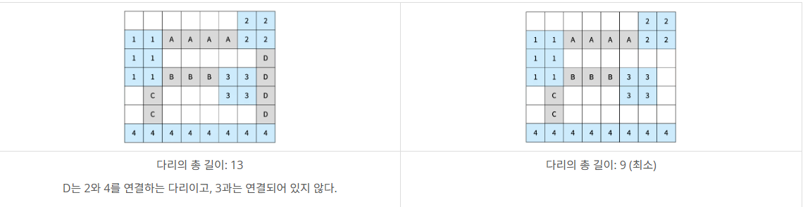

# 17472 : 다리 만들기 2
- 문제 링크: [17472](https://www.acmicpc.net/problem/17472)

문제의 난도가 꽤 높아서, MST와 BFS/DFS에 익숙하지 않다면 나중에 푸는 것을 추천합니다.<br>
제가 웬만하면 50줄 이내, DFS/BFS라도 80줄 이내에 푸는데 이 문제는 100줄이 넘어갔네요.<br>

## 문제
### 내용
섬으로 이루어진 나라가 있고, 모든 섬을 다리로 연결하려고 한다. 이 나라의 지도는 N×M 크기의 이차원 격자로 나타낼 수 있고, 격자의 각 칸은 땅이거나 바다이다.

섬은 연결된 땅이 상하좌우로 붙어있는 덩어리를 말하고, 아래 그림은 네 개의 섬으로 이루어진 나라이다. 색칠되어있는 칸은 땅이다.


다리는 바다에만 건설할 수 있고, 다리의 길이는 다리가 격자에서 차지하는 칸의 수이다. 다리를 연결해서 모든 섬을 연결하려고 한다. 섬 A에서 다리를 통해 섬 B로 갈 수 있을 때, 섬 A와 B를 연결되었다고 한다. 다리의 양 끝은 섬과 인접한 바다 위에 있어야 하고, 한 다리의 방향이 중간에 바뀌면 안된다. 또, 다리의 길이는 2 이상이어야 한다.

다리의 방향이 중간에 바뀌면 안되기 때문에, 다리의 방향은 가로 또는 세로가 될 수 밖에 없다. 방향이 가로인 다리는 다리의 양 끝이 가로 방향으로 섬과 인접해야 하고, 방향이 세로인 다리는 다리의 양 끝이 세로 방향으로 섬과 인접해야 한다.

섬 A와 B를 연결하는 다리가 중간에 섬 C와 인접한 바다를 지나가는 경우에 섬 C는 A, B와 연결되어있는 것이 아니다. 

아래 그림은 섬을 모두 연결하는 올바른 2가지 방법이고, 다리는 회색으로 색칠되어 있다. 섬은 정수, 다리는 알파벳 대문자로 구분했다.



다음은 올바르지 않은 3가지 방법이다


다리가 교차하는 경우가 있을 수도 있다. 교차하는 다리의 길이를 계산할 때는 각 칸이 각 다리의 길이에 모두 포함되어야 한다. 아래는 다리가 교차하는 경우와 기타 다른 경우에 대한 2가지 예시이다.


나라의 정보가 주어졌을 때, 모든 섬을 연결하는 다리 길이의 최솟값을 구해보자.

### 입력
첫째 줄에 지도의 세로 크기 N과 가로 크기 M이 주어진다. 둘째 줄부터 N개의 줄에 지도의 정보가 주어진다. 각 줄은 M개의 수로 이루어져 있으며, 수는 0 또는 1이다. 0은 바다, 1은 땅을 의미한다.

### 출력
모든 섬을 연결하는 다리 길이의 최솟값을 출력한다. 모든 섬을 연결하는 것이 불가능하면 -1을 출력한다.

## 풀이
### 풀이 코드
```cpp
/*
1. BFS를 통해 같은 섬을 탐색하고, SetUnion을 통해 하나로 묶는다.
cf) Union-Find를 쉽게 하기 위해, (y, x) <-> idx를 만든다.
배열 계산법과 동일하다.
2. 섬의 특정 위치에서 방향을 정하고 다리를 놓을 수 있는지 확인한다.
범위를 벗어나면 취소하고, 다리의 길이가 1이라면 취소한다.
3. 놓을 수 있는 다리는 vector에 저장한다. 
<시작지점, 방향, 길이>를 모두 기록한다.
그 후, 길이가 짧은 순으로 정렬한다.
4. 다리를 놓을 두 섬이 연결되어 있는지 FindParent로 확인한다.
놓을 수 있다면 놓으며 정답에 길이를 추가하고,
이미 연결되어 있다면 넘어간다.
5. 다리를 다 놓았지만 모든 섬이 연결되지 않았다면 -1을 출력하고,
아니라면 정답을 출력한다.
*/
#include <bits/stdc++.h>
using namespace std;

int N, M;
int dy[4] = { 1, -1, 0, 0 }; // BFS용
int dx[4] = { 0, 0, 1, -1 }; // BFS용

vector<int> parent; // 
vector<vector<int>> grid;
vector<vector<bool>> isVisited; // BFS용

// x, y -> idx, idx -> y, idx -> x 변경 함수들
inline int CalIdx(int y, int x) { return (y * M) + x; }
inline int GetY(int idx) { return (idx / M); }
inline int GetX(int idx) { return (idx % M); }

int FindParent(int a) {
	if (a == parent[a]) return a;
	return parent[a] = FindParent(parent[a]);
}

void SetUnion(int a, int b) { // 코드 간략화를 위해 rank 생략
	int rootX = FindParent(a);
	int rootY = FindParent(b);
    // 앞 매개변수에 몰아주기
	if (rootX != rootY) parent[rootY] = rootX; 
}

int main()
{
	ios::sync_with_stdio(0), cin.tie(0);
	cin >> N >> M;

	parent.assign(N * M, 0);
	grid.assign(N, vector<int>(M));
	isVisited.assign(N, vector<bool>(M, false));

	for (int i = 0; i < parent.size(); i++) parent[i] = i;
	for (int i = 0; i < N; i++) {
		for (int j = 0; j < M; j++) {
			cin >> grid[i][j];
			if (grid[i][j] == 0) { // 바다라면
				int curIdx = CalIdx(i, j); // 인덱스 계산 후
				parent[curIdx] = -1; // 부모값 -1로 변경
			}
		}
	}

	// 1. 군집 설정
    // 섬의 갯수만 기록해도 되지만, 디버깅을 위해 vector로 했음.
	vector<int> islands; 
	for (int i = 0; i < N; i++) {
		for (int j = 0; j < M; j++) {
			if (grid[i][j] == 0) continue; // 바다면 통과
			if (isVisited[i][j]) continue; // 방문했다면 통과

			int rootIdx = CalIdx(i, j); // 시작지점의 인덱스 계산
			islands.push_back(rootIdx); // 섬 목록에 추가

			queue<pair<int, int>> q; // BFS용 큐
			q.push({ i, j }); // 큐에 현재 y, x 넣기
			while (!q.empty()) { // BFS 진행
				auto [cy, cx] = q.front();
				q.pop();
				if (isVisited[cy][cx]) continue;
				isVisited[cy][cx] = true;
				int curIdx = CalIdx(cy, cx);
				SetUnion(rootIdx, curIdx); // 시작지점과 합치기
				for (int dir = 0; dir < 4; dir++) {
					int ny = cy + dy[dir];
					int nx = cx + dx[dir];
					if (ny < 0 || ny >= N || nx < 0 || nx >= M) continue;
					if (grid[ny][nx] == 0 || isVisited[ny][nx]) continue;
					q.push({ ny, nx });
				}
			}
		}
	}

	// 2. 길 찾기
	vector<tuple<int, int, int>> edge; // <출발지 idx, 방향, 길이>
	for (int i = 0; i < N; i++) {
		for (int j = 0; j < M; j++) {
			if (grid[i][j] == 0) continue;
			int rootParent = FindParent(CalIdx(i, j));
			int cy = i, cx = j;
			for (int k = 0; k < 4; k++) {
				int ny = cy, nx = cx;
				while (1) {
					ny += dy[k];
					nx += dx[k];
					if (ny < 0 || ny >= N || nx < 0 || nx >= M) break; // 범위 밖
					if (grid[ny][nx] == 1) break; // 다른 섬 도달
				}
				if (ny < 0 || ny >= N || nx < 0 || nx >= M) continue;
				int len = abs(ny - cy) + abs(nx - cx);
				if (len <= 2) continue;
				edge.push_back({ CalIdx(i, j), k, len });
			}
		}
	}	

	// 3. 길이 기준으로 정렬
	sort(edge.begin(), edge.end(), [](auto& tiii1, auto& tiii2) {
		return get<2>(tiii1) < get<2>(tiii2);
		});

    // 4. 다리 놓기
	int edgeCnt = 0, islandCnt = islands.size(), answer = 0;
	for (auto& [startIdx, dir, len] : edge) {
        // 시작 Y, X
		int startY= GetY(startIdx), startX = GetX(startIdx); 
		// 도착지 Y, X, Idx
        int endY = startY + (len * dy[dir]);
		int endX = startX + (len * dx[dir]);
		int endIdx = CalIdx(endY, endX);

        // 두 섬이 연결되지 않았다면
		if (FindParent(startIdx) != FindParent(endIdx)) {
			for (int i = 1; i < len; i++) {
				int ny = startY + (dy[dir] * i);
				int nx = startX + (dx[dir] * i);
				grid[ny][nx] = 2; // 길 표시
			}
			SetUnion(startIdx, endIdx); // 섬 연결
			answer += (len - 1); // 길이 추가
            // len은 좌표 차이이므로 다리 길이는 (차이 - 1)
			edgeCnt++; // edge 추가
		}
		if (edgeCnt == islandCnt - 1) break;
	}
	
    // edge 수가 모자르면 연결 안됨
	if (edgeCnt != islandCnt - 1) cout << "-1"; 
    else cout << answer;
}
```