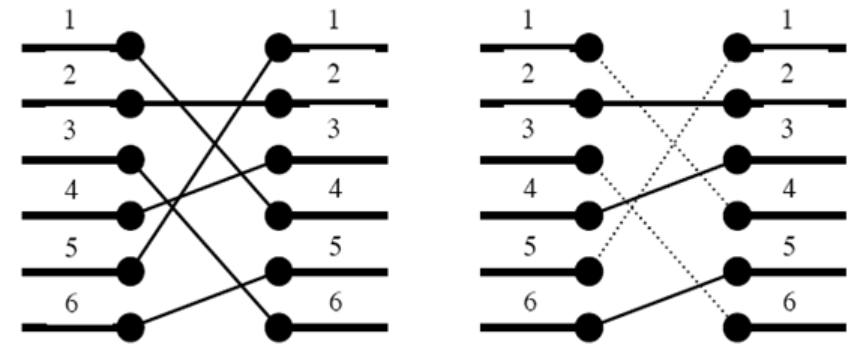

# 2352 : 반도체 설계
- 문제 링크: [2352](https://www.acmicpc.net/problem/1365)

## 문제
### 내용
반도체를 설계할 때 n개의 포트를 다른 n개의 포트와 연결해야 할 때가 있다.



예를 들어 왼쪽 그림이 n개의 포트와 다른 n개의 포트를 어떻게 연결해야 하는지를 나타낸다. 하지만 이와 같이 연결을 할 경우에는 연결선이 서로 꼬이기 때문에 이와 같이 연결할 수 없다. n개의 포트가 다른 n개의 포트와 어떻게 연결되어야 하는지가 주어졌을 때, 연결선이 서로 꼬이지(겹치지, 교차하지) 않도록 하면서 최대 몇 개까지 연결할 수 있는지를 알아내는 프로그램을 작성하시오

### 입력

첫째 줄에 정수 n(1 ≤ n ≤ 40,000)이 주어진다. 다음 줄에는 차례로 1번 포트와 연결되어야 하는 포트 번호, 2번 포트와 연결되어야 하는 포트 번호, …, n번 포트와 연결되어야 하는 포트 번호가 주어진다. 이 수들은 1 이상 n 이하이며 서로 같은 수는 없다고 가정하자.

### 출력

첫째 줄에 최대 연결 개수를 출력한다.

## 풀이
### 풀이 코드
```cpp
/*
1. 값이 들어올 때마다 해당 값보다 큰 값이 있는지 확인하는 LIS 풀이법입니다.
*/
#include <bits/stdc++.h>
using namespace std;

int main()
{
    ios::sync_with_stdio(0), cin.tie(0);

    int N;
    cin >> N;
    vector<int> saved; // 최장 증가 부분 수열(LIS)에 해당하는 값을 저장할 벡터

    // 모든 포트의 연결 정보를 한 줄씩 읽음
    while (N--) {
        int i;
        cin >> i; // 현재 왼쪽 포트에 연결되어야 하는 오른쪽 포트 번호 입력

        // saved 벡터에서 현재 값 i보다 큰 첫 번째 원소의 위치를 이분 탐색(upper_bound)으로 찾음
        auto it = upper_bound(saved.begin(), saved.end(), i);

        // 만약 i보다 큰 원소가 없다면, i는 현재 증가 부분 수열의 맨 끝에 추가할 수 있음
        if (it == saved.end())
            saved.push_back(i);
        else
            // 이미 존재하는 원소 중 i보다 크거나 같은 최초 원소를 i로 대체
            // 이후 더 긴 증가 수열을 만들기 위한 후보값으로 갱신
            *it = i;
    }

    // saved 벡터의 크기는 전선이 꼬이지 않게 연결할 수 있는 최대 연결선 개수(최장 증가 부분 수열의 길이)를 의미함
    cout << saved.size();
}

```